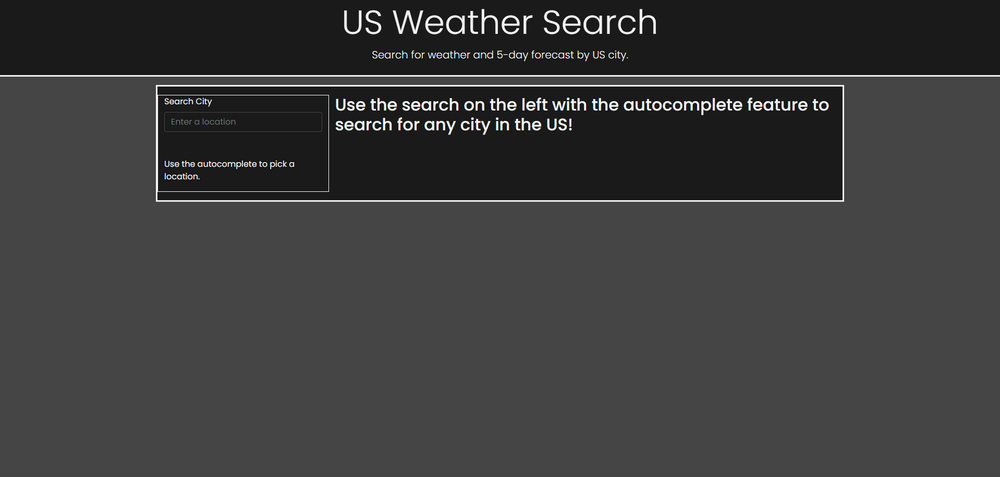

# City Weather Search

## Description
Simple application that used openweather, and google places API to search and display current and 5 day weather forecast for a US city.

## Installation

N/A

## Usage
Open up https://larwis95.github.io/city-weather-search/ in your browser. Type into the provided search box to see an autocomplete box, select the city you are searching for from the list and hit enter. The page will be updates with current weather and 5-day forecast for that city. A dropdown search history will appear after your first search, click on it and select an item from the list to see the current weather and 5-day forecast for that item. Up to 5 items will be stored in history. 

## Screen shot

## License

N/A